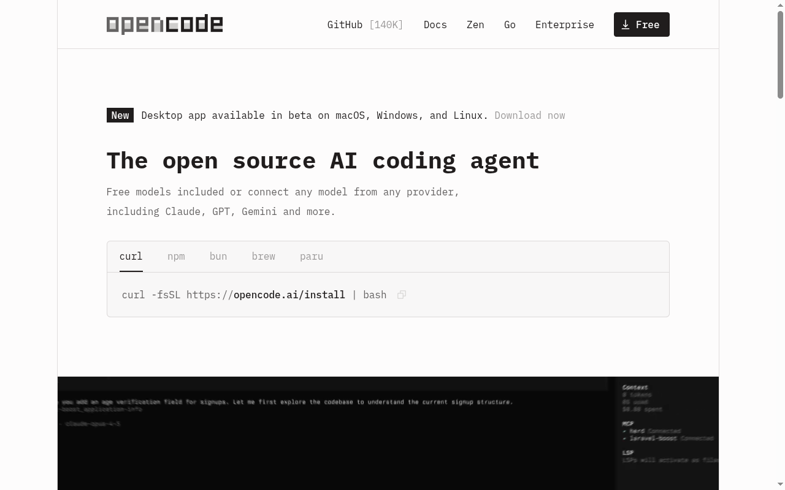
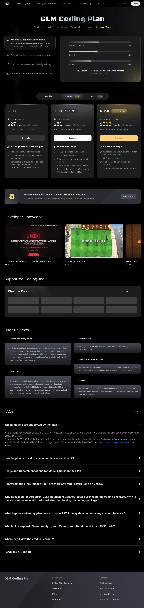
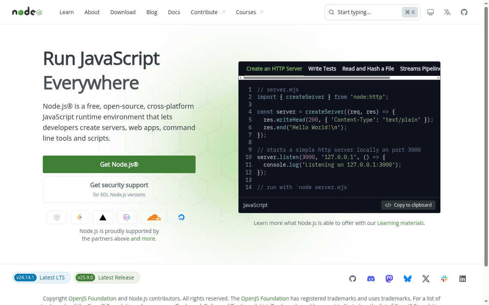
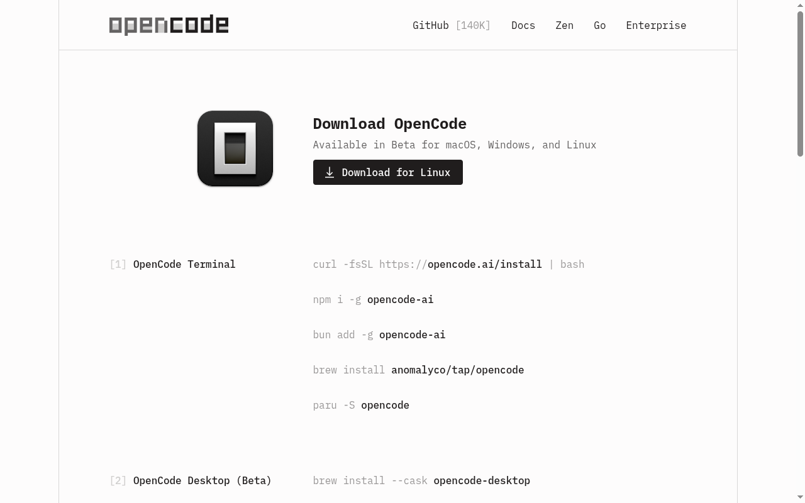
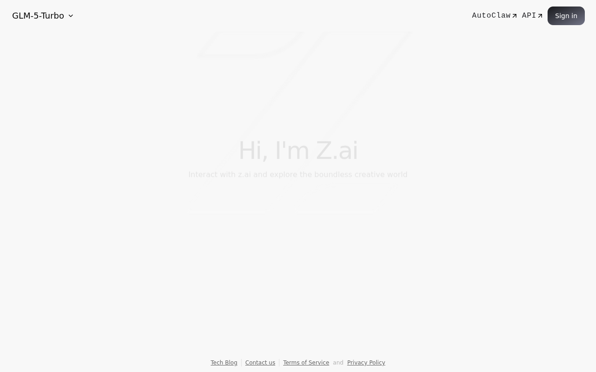
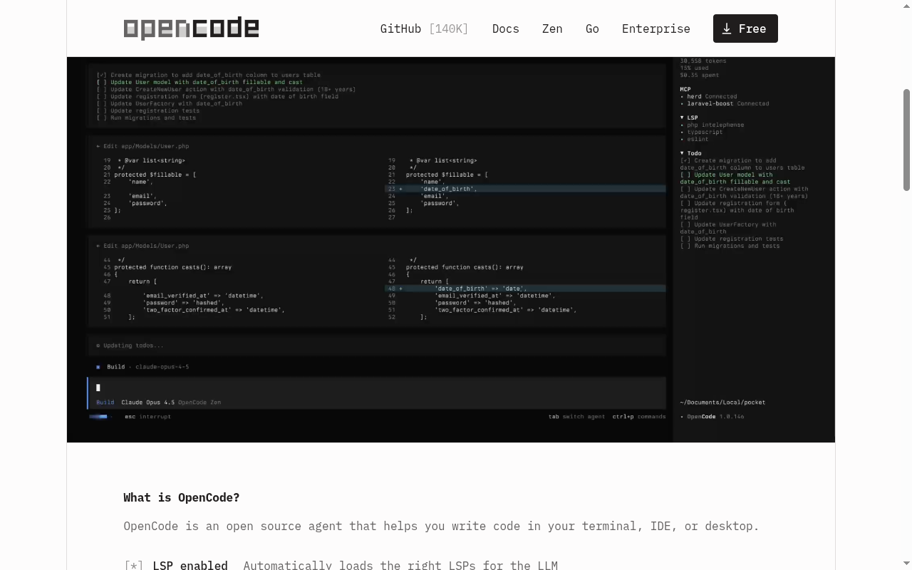
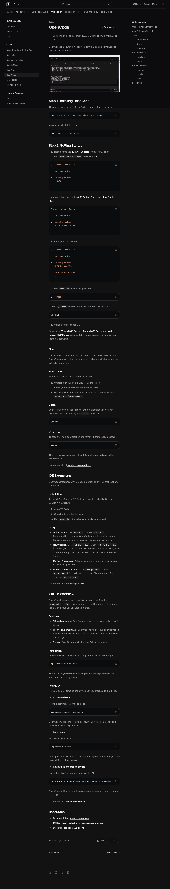
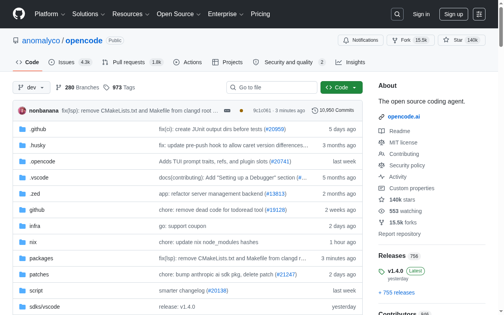
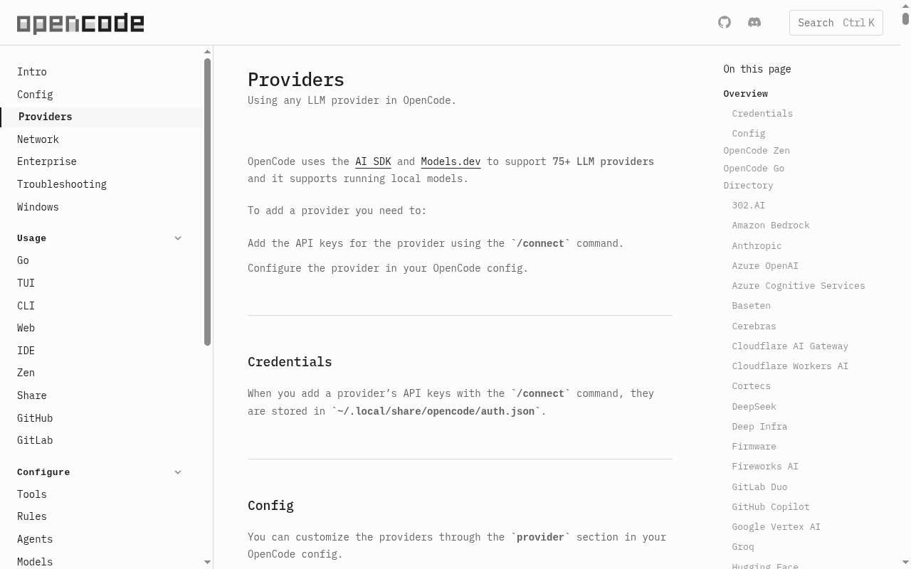

# Agentic Engineering with OpenCode + GLM (Z.AI Coding Plan)

## A Beginner-Friendly Guide for Windows & Mac

> *This guide was researched and written by [Claude](https://claude.ai) (Anthropic's AI), using Claude Code. All screenshots were captured live and all information was verified against the official sources at the time of writing. If something looks outdated, check the [Useful Links](#useful-links--resources) section for the latest docs.*

---

## What Is This Guide About?

This guide teaches you how to set up a powerful **AI coding assistant** on your computer — for a fraction of the cost of other options. No prior coding experience needed.

**What you'll get:** An AI that lives in your terminal, understands plain English, and can write code, create files, fix bugs, and run commands — all by itself. You just tell it what you want.

| Tool | What It Is |
|------|-----------|
| **OpenCode** | A free, open-source AI coding agent you run on your computer |
| **GLM (by Z.AI)** | The AI brain that powers it — made by Zhipu AI, a leading Chinese AI company |
| **Z.AI Coding Plan** | A cheap subscription that gives you access to GLM's best models |



> **Think of it like this:** OpenCode is the app on your computer. GLM is the AI brain in the cloud. The Coding Plan is your monthly pass to use that brain.

---

## Pricing: Why This Combo Is an Incredible Deal

This is the main reason to pay attention. The Z.AI Coding Plan gives you **dramatically more usage** than Claude Pro at a lower or similar price point.

### The Comparison

| | **Z.AI Lite** | **Z.AI Pro** | **Claude Pro** |
|---|---|---|---|
| **Monthly price** | **$10/mo** | **$30/mo** | $20/mo |
| **Prompts per 5 hours** | ~80 | ~400 | ~25-30 |
| **Prompts per week** | ~400 | ~2,000 | ~100-150 |
| **First month promo** | **$3** | **$15** | None |

### What this means in plain English

- **Z.AI Lite ($10/month)** costs **half** of Claude Pro ($20/month), but gives you roughly **3 times the usage**. That's 6x the value per dollar.

- **Z.AI Pro ($30/month)** costs just **$10 more** than Claude Pro ($20/month), but gives you roughly **15 times the usage**. For 1.5x the price, you get 15x the prompts.

- **First month?** Try Z.AI Lite for just $3, or Pro for $15. That's an insane deal to test the waters.

### Visual: The Pricing Page



> Visit the pricing page yourself: [z.ai/subscribe](https://z.ai/subscribe)

### What does "prompt" mean?

Every time you ask the AI to do something — "build me a website", "fix this bug", "explain this code" — that counts as one prompt. Behind the scenes, the AI might make 15-20 internal calls to think, plan, and act. The Coding Plan bundles all of that into a single "prompt" count, so you don't get nickel-and-dimed.

### What AI models do you get?

All Coding Plan tiers include:

| Model | Best For |
|-------|---------|
| **GLM-5.1** | Complex tasks, big projects (flagship, 754B parameters, state-of-the-art) |
| **GLM-5-Turbo** | Fast responses for medium tasks |
| **GLM-4.7** | Everyday coding — great balance of speed and quality |
| **GLM-4.5-Air** | Quick questions, simple edits (saves quota) |

**Free option:** GLM-4.7-Flash and GLM-4.5-Flash are completely **free** on the pay-as-you-go API. Great for trying things out before subscribing.

---

## What You Need Before Starting

You need two things installed on your computer:
1. **Node.js** (a free program that OpenCode needs to run)
2. **OpenCode** itself

That's it. Let's go step by step.

### First: What Is a Terminal?

A **terminal** is a text-based app where you type commands instead of clicking buttons. It looks like a black (or white) window with text. Every computer has one built in.

**On Mac:**
- Press `Cmd + Space` (the Spotlight search)
- Type **Terminal**
- Press Enter

You'll see something like this — a window with a blinking cursor waiting for you to type:

```
yourname@MacBook ~ %
```

**On Windows:**
- Press the **Windows key** on your keyboard
- Type **PowerShell**
- Click **Windows PowerShell**

You'll see something like:

```
PS C:\Users\yourname>
```

> **Keep this window open.** You'll be typing commands here for the rest of the guide. When the guide says "paste this command", you literally copy the text and paste it into this window, then press Enter.

---

## Step 1: Install Node.js

Node.js is a free program that OpenCode needs to work. Think of it like how a car needs gas — OpenCode is the car, Node.js is the gas.

### On Windows (the easy way)



1. Open your web browser and go to **https://nodejs.org**
2. Click the big green **"Get Node.js"** button (it says "LTS" — that means the stable version)
3. A file will download (something like `node-v24.14.1-x64.msi`)
4. **Double-click** the downloaded file to run the installer
5. Click **Next** on every screen, then click **Install**
6. When it finishes, click **Finish**
7. **Close and reopen PowerShell** (important — it won't work until you do this)
8. Type this and press Enter to verify:
   ```powershell
   node --version
   ```
   You should see something like `v24.14.1`. If you do, it worked!

### On Mac

1. Open **Terminal** (Cmd + Space, type Terminal, press Enter)
2. Copy and paste this entire line, then press Enter:
   ```bash
   curl -fsSL https://fnm.vercel.app/install | bash
   ```
   This installs a tiny helper tool that manages Node.js for you.
3. **Close Terminal completely** (Cmd + Q) and **reopen it**
4. Paste this and press Enter:
   ```bash
   fnm install --lts
   ```
5. Verify it worked:
   ```bash
   node --version
   ```
   You should see something like `v24.14.1`.

> **Stuck?** If `node --version` gives an error, close your terminal, reopen it, and try again. The installation only takes effect after reopening.

---

## Step 2: Install OpenCode



### On Mac

Open Terminal and paste this command:

```bash
curl -fsSL https://opencode.ai/install | bash
```

That's it. It downloads and installs OpenCode automatically.

**Alternative** — if you already have Homebrew (a Mac package manager):
```bash
brew install anomalyco/tap/opencode
```

### On Windows

Open PowerShell and paste:

```powershell
npm i -g opencode-ai
```

> `npm` is a tool that came with Node.js. It downloads and installs programs. The `-g` means "install it globally" so you can use it from anywhere.

### Desktop App (Optional — Beta)

OpenCode also has a desktop app with a graphical interface (instead of the terminal). It's still in beta, but if you prefer clicking buttons over typing commands:

- **Mac:** `brew install --cask opencode-desktop` or download the `.dmg` from [opencode.ai/download](https://opencode.ai/download)
- **Windows:** Download the installer from [opencode.ai/download](https://opencode.ai/download)

### Verify It Worked

Type this in your terminal:

```bash
opencode --version
```

You should see a version number like `1.4.0`. If you do, you're ready for the next step!

> **Seeing "command not found"?** Close your terminal, reopen it, and try again. If it still doesn't work, try reinstalling with the npm method: `npm i -g opencode-ai`

---

## Step 3: Get Your Z.AI API Key

An **API key** is like a password that lets OpenCode talk to Z.AI's AI. You need one to use the Coding Plan.

### 3a. Create a Z.AI Account

1. Open your browser and go to **https://z.ai**



2. Click **Sign in** (top right)
3. Create an account using your email, Google, or GitHub

### 3b. Subscribe to a Coding Plan

1. Go to **https://z.ai/subscribe**


2. Choose your plan:
   - **Lite ($10/month)** — Great to start. $3 for the first month!
   - **Pro ($30/month)** — Best value. $15 for the first month!
3. Enter your payment info and confirm

### 3c. Create Your API Key

1. Go to **https://z.ai/manage-apikey/apikey-list**
2. Click **"Create a new API key"**
3. Give it a name like `opencode`
4. **IMPORTANT: Copy the key immediately** and save it somewhere safe (like a notes app). You won't be able to see it again after closing the dialog!

The key looks something like: `abc123def456.xxxxxxxxxxxxxxxx`

> **Keep your API key secret.** Never share it online or post it publicly. Anyone with your key can use your subscription and rack up charges.

---

## Step 4: Connect OpenCode to Z.AI

This is where it all comes together. You're going to tell OpenCode to use Z.AI as its AI brain.

### Method A: The Easy Way (Interactive Setup)

1. Open your terminal
2. Type `opencode` and press Enter

You'll see the OpenCode interface — a dark-themed text chat:



3. Type this command inside OpenCode:
   ```
   /connect
   ```
4. A list of AI providers will appear. Search for **"Z.AI"**
5. Select **"Z.AI Coding Plan"** (not the regular "Z.AI" — you want the Coding Plan endpoint)
6. Paste your API key when asked
7. Press Enter

**That's it!** You're connected. Type `/models` to see and select which GLM model to use.

### Method B: Configuration File (For More Control)

If Method A doesn't work, or if you want more control:

1. **Find your home folder:**
   - **Mac:** Open Finder, press `Cmd + Shift + G`, type `~` and press Enter
   - **Windows:** Open File Explorer, type `%USERPROFILE%` in the address bar and press Enter

2. **Create a new file** called `.opencode.json` (note the dot at the beginning!)
   - **Mac:** Open Terminal and type: `touch ~/.opencode.json && open -a TextEdit ~/.opencode.json`
   - **Windows:** Open PowerShell and type: `New-Item -Path "$env:USERPROFILE\.opencode.json" -ItemType File`
     Then open it in Notepad: `notepad "$env:USERPROFILE\.opencode.json"`

3. **Paste this into the file** and save:

```json
{
  "$schema": "https://opencode.ai/config.json",
  "provider": {
    "zai": {
      "options": {
        "baseURL": "https://api.z.ai/api/coding/paas/v4"
      }
    }
  }
}
```

4. **Set your API key:**

   **On Mac** — paste this in Terminal (replace `your_key_here` with your actual key):
   ```bash
   echo 'export ZAI_API_KEY="your_key_here"' >> ~/.zshrc
   source ~/.zshrc
   ```

   **On Windows** — paste this in PowerShell (replace `your_key_here` with your actual key):
   ```powershell
   [System.Environment]::SetEnvironmentVariable("ZAI_API_KEY", "your_key_here", "User")
   ```
   Then **close and reopen PowerShell**.

5. **Launch OpenCode:**
   ```bash
   opencode
   ```



> For the official Z.AI setup docs, visit: [docs.z.ai/devpack/tool/opencode](https://docs.z.ai/devpack/tool/opencode)

---

## Step 5: Start Building Things!

You're all set up. Here's how to actually use OpenCode day-to-day.

### Launching OpenCode

Every time you want to use it:

1. Open your terminal
2. Navigate to a folder where you want your project (or create one):
   ```bash
   mkdir ~/my-project
   cd ~/my-project
   ```
   > `mkdir` creates a new folder. `cd` moves into it.
3. Launch:
   ```bash
   opencode
   ```

### Your First Conversation

Just type naturally, like you're talking to a person:

```
Create a Python file called hello.py that prints "Hello, World!"
and asks the user for their name, then greets them.
```

The AI will:
1. Think about what to do
2. Write the code
3. **Ask for your permission** before saving the file
4. Show you the result

### The Permission System

OpenCode always asks before doing anything to your files. You'll see:

```
Allow writing to hello.py? [a]llow once / [A]llow session / [d]eny
```

| Key | What It Does |
|-----|-------------|
| **`a`** | Allow this one time |
| **`A`** (capital) | Allow for the rest of this session (no more asking) |
| **`d`** | Deny — don't do it |

> **Tip:** Press `A` early on so you're not constantly approving. You can always use `/undo` if something goes wrong.

### Essential Keyboard Shortcuts & Commands

| What to Do | How to Do It |
|-----------|-------------|
| Send a message | Type your request and press `Enter` or `Ctrl+S` |
| Switch AI models | Press `Ctrl+O` or type `/models` |
| Undo last file change | Type `/undo` |
| Redo an undo | Type `/redo` |
| Save memory (long conversations) | Type `/compact` |
| Switch to Plan mode (read-only) | Press `Tab` |
| Switch back to Build mode | Press `Tab` again |
| Open command menu | Press `Ctrl+K` |
| Quit OpenCode | Press `Ctrl+C` |

### Reference Files with @

Want the AI to look at a specific file? Use `@`:

```
Look at @index.html and fix the broken navigation links
```

```
Explain what @styles.css does
```

The `@` symbol triggers a file search — just start typing the filename after it.

### Choosing the Right Model

Press `Ctrl+O` to switch models. Here's when to use each:

| Model | When to Use | Quota Cost |
|-------|------------|-----------|
| **GLM-5.1** | Complex projects, multi-file changes, hard bugs | High (3x during peak hours) |
| **GLM-5-Turbo** | Medium tasks, faster than 5.1 | Medium-High (2x during peak hours) |
| **GLM-4.7** | Everyday coding — best default choice | Normal |
| **GLM-4.5-Air** | Quick questions, simple edits, explanations | Low |

> **Peak hours** are 2:00 PM - 6:00 PM Beijing time (6:00 AM - 10:00 AM UTC). GLM-5.1 costs 3x quota during these hours. Use GLM-4.7 during peak times to save quota.

### Build Mode vs Plan Mode

OpenCode has two modes you switch between with `Tab`:

| Mode | What It Does | When to Use |
|------|-------------|------------|
| **Build** (default) | Can create, edit, and delete files. Runs commands. | When you want the AI to actually build something |
| **Plan** | Read-only. Can look at files but can't change anything. | When you want the AI to explain, analyze, or plan without touching anything |

> **Beginner tip:** Start in **Plan** mode when you're unsure. Ask the AI to explain its plan, then switch to **Build** when you're ready.

---

## Real Example: Build a Personal Website

Here's a complete example of what a session looks like:

**You type:**
```
Create a personal portfolio website with:
- A homepage with my name "Alex" and a short bio
- A projects section with 3 placeholder project cards
- A contact form with name, email, and message fields
- Modern, professional dark mode design
- Use only HTML and CSS (no frameworks)
```

The AI will create `index.html` and `styles.css`, write all the code, and you'll have a working website.

**Then you can refine it:**
```
Add smooth scroll animations when clicking nav links.
Make the project cards have a hover effect.
Make everything look good on mobile phones too.
```

**And learn from it:**
```
Explain the CSS grid layout you used for the project cards,
step by step, like I'm a complete beginner.
```

---

## Tips for Getting the Most Out of OpenCode

### 1. Be Specific in Your Requests

| Instead of... | Say... |
|--------------|--------|
| "Make a website" | "Create an HTML page with a blue gradient header, a nav bar with Home/About/Contact links, and a footer showing 2026" |
| "Fix the bug" | "The button on line 45 of index.html doesn't do anything when clicked. Make it open a popup with a greeting." |
| "Make it better" | "Add a loading spinner that appears when the form is submitted, and show a success message after 2 seconds" |

### 2. Start Small, Then Build Up

Begin with single-file projects (one HTML file, one Python script). As you get comfortable, try multi-file projects with separate HTML, CSS, and JavaScript files.

### 3. Use Plan Mode to Learn

Before building, switch to **Plan** mode (press `Tab`) and ask:
```
I want to build a to-do list app. What files would I need
and how would they work together? Explain simply.
```

### 4. Watch Your Quota

- Use **GLM-4.7** as your default (best value)
- Only switch to **GLM-5.1** for complex tasks
- Use **GLM-4.5-Air** for quick questions
- Avoid peak hours (2-6 PM Beijing time) for the flagship models

### 5. Learn From the AI

After the AI writes code, ask it to teach you:
```
Walk me through this code line by line.
Explain every part as if I've never programmed before.
```

---

## Troubleshooting Common Issues

### "opencode: command not found"

**Fix:** Close your terminal completely and reopen it. If that doesn't work:
- **Mac:** Run the install command again: `curl -fsSL https://opencode.ai/install | bash`
- **Windows:** Run `npm i -g opencode-ai` again. Make sure Node.js is installed first (`node --version`).

### "Authentication failed" or "Invalid API key"

**Fix:**
1. Go to https://z.ai/manage-apikey/apikey-list and verify your key exists
2. Make sure you copied the **entire** key (it has a dot in the middle)
3. Try using `/connect` inside OpenCode to re-enter the key
4. Make sure you selected "Z.AI **Coding Plan**" (not regular "Z.AI")

### "Model not available" or "Quota exceeded"

**Fix:**
1. Check your subscription at https://z.ai/subscribe
2. You might have hit your hourly or weekly limit — wait a bit
3. Switch to a lighter model: type `/models` and pick GLM-4.7 or GLM-4.5-Air

### The AI seems slow or stuck

**Fix:**
1. Press `Ctrl+C` to quit, then restart with `opencode`
2. Type `/compact` to summarize a long conversation (frees up memory)
3. Switch to GLM-4.7 or GLM-5-Turbo for faster responses

### "npm: command not found" (Windows)

**Fix:** Node.js isn't installed properly. Go back to Step 1 and reinstall it from https://nodejs.org. Make sure to restart PowerShell after installing.

---

## Useful Links & Resources

| Resource | Link | What It's For |
|----------|------|--------------|
| **OpenCode Website** | [opencode.ai](https://opencode.ai) | Main site, download links |
| **OpenCode Docs** | [opencode.ai/docs](https://opencode.ai/docs) | Full documentation |
| **OpenCode GitHub** | [github.com/anomalyco/opencode](https://github.com/anomalyco/opencode) | Source code, issues, updates |
| **OpenCode Download** | [opencode.ai/download](https://opencode.ai/download) | Desktop app & all install methods |
| **Z.AI Platform** | [z.ai](https://z.ai) | Z.AI main site |
| **Z.AI Coding Plan** | [z.ai/subscribe](https://z.ai/subscribe) | Subscribe / manage your plan |
| **Z.AI API Keys** | [z.ai/manage-apikey/apikey-list](https://z.ai/manage-apikey/apikey-list) | Create & manage API keys |
| **Z.AI Docs** | [docs.z.ai](https://docs.z.ai) | Official Z.AI documentation |
| **Z.AI + OpenCode Setup** | [docs.z.ai/devpack/tool/opencode](https://docs.z.ai/devpack/tool/opencode) | Official setup guide |
| **OpenCode Providers** | [opencode.ai/docs/providers](https://opencode.ai/docs/providers) | All supported AI providers |





---

## Glossary (Jargon Buster)

New to tech? Here's what all these words mean:

| Term | Plain English Meaning |
|------|----------------------|
| **Terminal** | The text-based app on your computer where you type commands (Terminal on Mac, PowerShell on Windows) |
| **CLI** | "Command Line Interface" — just means a program you use by typing, not clicking |
| **API Key** | A secret password that lets one app talk to another app's service |
| **LLM** | "Large Language Model" — the AI that understands and writes text and code |
| **Agentic AI** | An AI that can **do things** (create files, run programs), not just chat |
| **Prompt** | A message you send to the AI — your request or question |
| **Token** | A tiny chunk of text (roughly 3/4 of a word). AI services measure usage in tokens |
| **Node.js** | A free program that lets JavaScript (a programming language) run on your computer. OpenCode needs it |
| **npm** | "Node Package Manager" — a tool (comes with Node.js) that downloads and installs programs |
| **TUI** | "Terminal User Interface" — a visual interface that works inside the terminal (what OpenCode looks like) |
| **Open-source** | Software whose code is free and public. Anyone can use, modify, or contribute to it |
| **MoE** | "Mixture of Experts" — a clever AI design where only the relevant parts of the brain activate for each task |
| **Quota** | Your usage allowance — how many prompts you can send in a time period |

---

*Guide last updated: April 2026*

*Written by [Claude](https://claude.ai) (Anthropic's AI) via [Claude Code](https://claude.ai/claude-code). Screenshots captured with Playwright. Published by [@seif9116](https://github.com/seif9116).*
